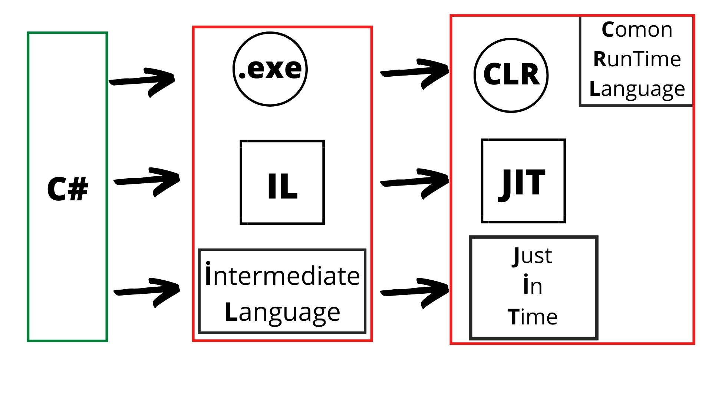

### CLI languages
> **C#** **Java**-ya baxılaraq yaradılmışdır.
> İşləmə mətiqi  Aşağıdakı kimidir.

> **C#** kodunun `bult` edilmiş forması yəni `IL` dilinə çevirilmiş formas `.exe` filedır 

> **IL** dili **Intermediate Language** olub. Komputer **IL** dilindəki file işlədərək **JIT** dilinə çevir. Nəticə etibarı ilə Program icra edilir.**IL** dili adından göründüyü kimi hər şeyin işlərənərək işləməyə hazır  vəziyyət gətirilmə mərhələsidir. 

> **Ide** => **Integrated Development Environment** kod yazmağa hazır mühit. 

> **DLL** => **Dynamic Link Library** Dinamik Kitabxana Linki. 

